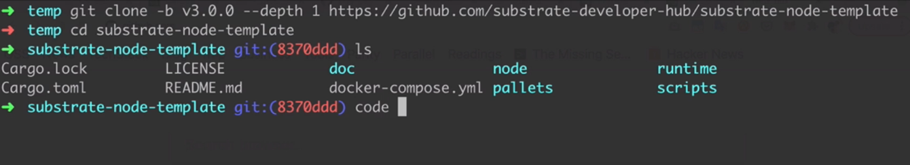
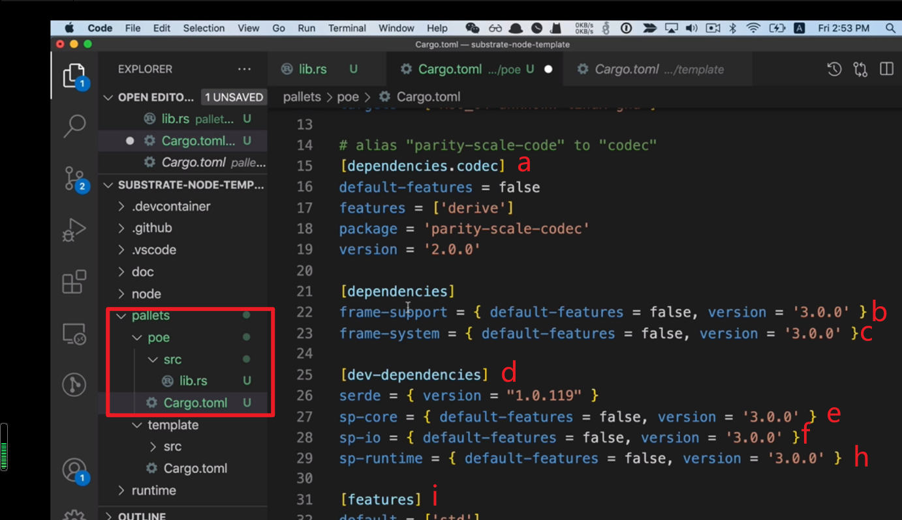
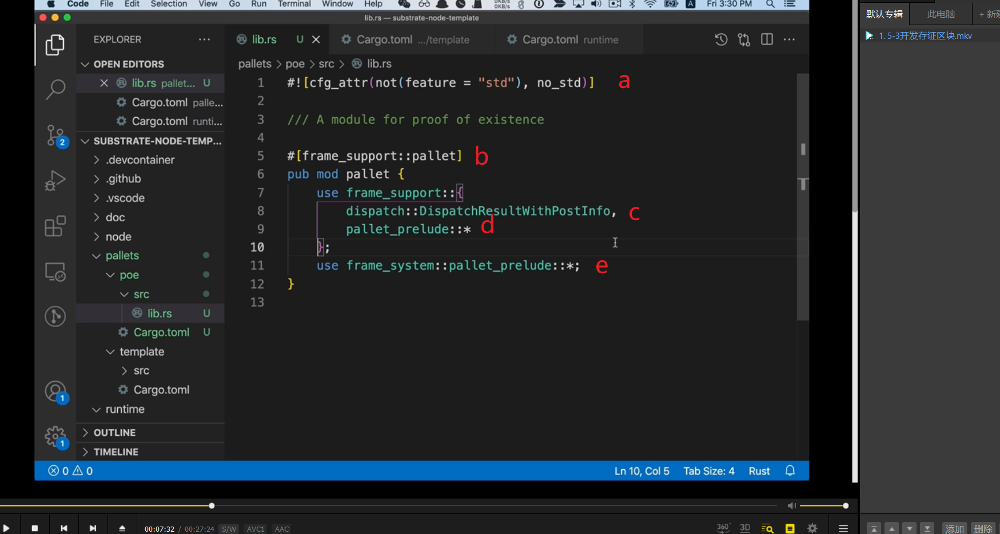

下载库

创建poe目录，Cargo.toml复制于template，只做了名称修改。  
a，编解码相关工具包  
b，runtime开发所需要使用的宏  
c，提供基础system模块。提供了runtime开发常用的类型，比如accountid，block bumber等类型。还有些公共存储单元。  
d，只会在test环境引入的工具包。  
e，定义核心组件，比如核心类型，核心接口  
f，定义常用io操作，文件读写，app请求等。  
h，定义runtime开发常用公共类型和接口。  
i，features是rust的编译标签进行条件编译，默认是std，如果是std模式就需要codec下的std，以及frame-support，frame-system都需要std这个feature来进行编译。（截图最后几行未截到）

a，编译标签，意思是编译时使用std或no_std，如果不是std，那就一定是no_std。   
b，定义功能模块，使用frame_support下的pallet宏。  
c，可调用函数的返回结果。  
d，runtime开发常用的宏  
e，系统模块需要的数据和类型信息。
